# Spaced repetition

How Kana Monster decides which names to ask and when to ask them again. The code is
`src/lib/deck.ts` (`nextBox`, `INTERVALS`, `dueAt`, `drawSet`, `pick`), and answers are recorded by
`grade` in `src/App.tsx`.



## The idea: boxes

The method is the Leitner system (Sebastian Leitner, 1970s). It was first done with paper flashcards
in a row of real boxes: a new card goes in box 1, a card you get right moves to the next box, a card
you get wrong goes back to box 1, and the further along a box is, the less often you go through it.
Which box a card is in says how well you know it and when you should see it again.

The app has no actual boxes. Every name has a level from 1 to 5, its box:

| Box | Means | Asked again after | Learning history shows it as |
|---|---|---|---|
| — | never answered | when it comes up as a new name | New (未學), as a silhouette |
| 1 | missed last time | straight away | Needs work (要加強) |
| 2 | learning | 3 minutes | Learning (學習中) |
| 3 | learning | 30 minutes | Learning (學習中) |
| 4 | learned | 1 day | Learned (熟記) |
| 5 | learned | 3 days | Learned (熟記) |

The five squares under each name in the learning history show its box.

## The rules

1. **Answering.** Right: up one box, at most 5 (a first right answer goes straight to box 2). Wrong:
   back to box 1. Either way the time of the answer is stored.
2. **Due.** A name is due once its box's interval has passed since its last answer.
3. **Choosing questions.** Each practice set (`drawSet`) and each challenge question (`pick`) takes, in
   this order:
   1. names that are due, the longest overdue first;
   2. names never answered, at random;
   3. only once neither is left: names not due yet, the soonest first.

A practice set is then shuffled, so the urgent names don't always come first.

## Why these intervals

They fit how the app is played. A game lasts about 2–3 minutes. A first sitting runs about an hour,
later visits are shorter, and people rarely keep going past two weeks. So a name answered right every
time comes back:

- in the next game (3 minutes),
- later in the same sitting (30 minutes),
- the next day,
- then every 3 days, which still gives several reviews within two weeks.

Longer steps, like Anki's or the classic Leitner system's (weeks to months), would mean a learned name
hardly comes up again in that time.

## Data

Both live in the browser's localStorage, so progress belongs to that browser on that device.

| Key | Holds |
|---|---|
| `kanamon.progress` | dex number → box |
| `kanamon.seen` | dex number → time of the last answer, in ms |

Progress saved before answer times were kept has no `seen` entry. It counts as long overdue, so those
names are asked again first, weakest box first.

## Limits, and what common practice does instead

- Reading and writing share one box per name. Anki would keep them as two cards.
- A missed name isn't asked again within the same set; it is the first one asked in the next set, and
  the summary offers to review the misses.
- There is no cap on new names per day.
- Answers are only right or wrong. SM-2 and FSRS (Anki's algorithms) use graded answers, such as
  "hard" or "easy", and adapt each card's intervals to them.

With only right or wrong answers, a small deck and short sessions, the Leitner system is the simpler
choice that still schedules well, and its boxes are what the learning history shows.

## Trying it

Run the app (`npm run dev`, then open http://localhost:5173), or open the Vercel preview of a pushed
branch.

- Answer a name wrong: it is the first one in the next set.
- Answer a name right: it stays away until its box's interval has passed. Box 2 means 3 minutes.

To skip the wait, make every answer an hour older from the browser console, then reload:

```js
const s = JSON.parse(localStorage.getItem('kanamon.seen') ?? '{}')
for (const id in s) s[id] -= 60 * 60 * 1000
localStorage.setItem('kanamon.seen', JSON.stringify(s))
```
